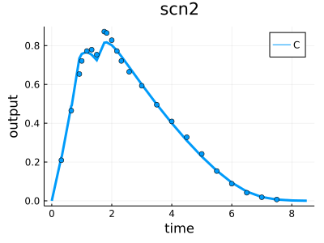
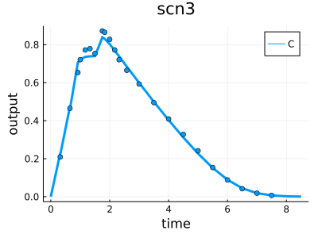

# alco

_Simple model of alcohol PK build on published data_

The model and data were reconstructed from the article:

> Mumenthaler MS, Taylor JL, Yesavage JA. _Ethanol pharmacokinetics in white women: nonlinear model fitting versus zero-order elimination analyses._ __Alcohol Clin Exp Res.__ 2000 Sep;24(9):1353-62. PMID: 11003200, DOI: [10.1111/j.1530-0277.2000.tb02103.x](https://doi.org/10.1111/j.1530-0277.2000.tb02103.x)

## Diagnostics

### Model 1

best F = -96.12

### Model 2

best F = -102.04

### Model 3

best F = -126.25

## Contributors

[Evgeny Metelkin](https://github.com/metelkin) is the author of the Heta-based modeling code.

The model and data in the study were reproduced from the published study.
The authors of the original study are:
Mumenthaler MS, Taylor JL, Yesavage JA.

